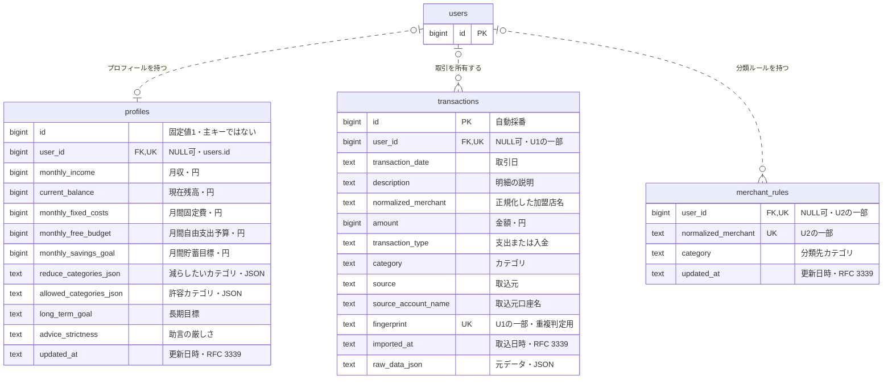
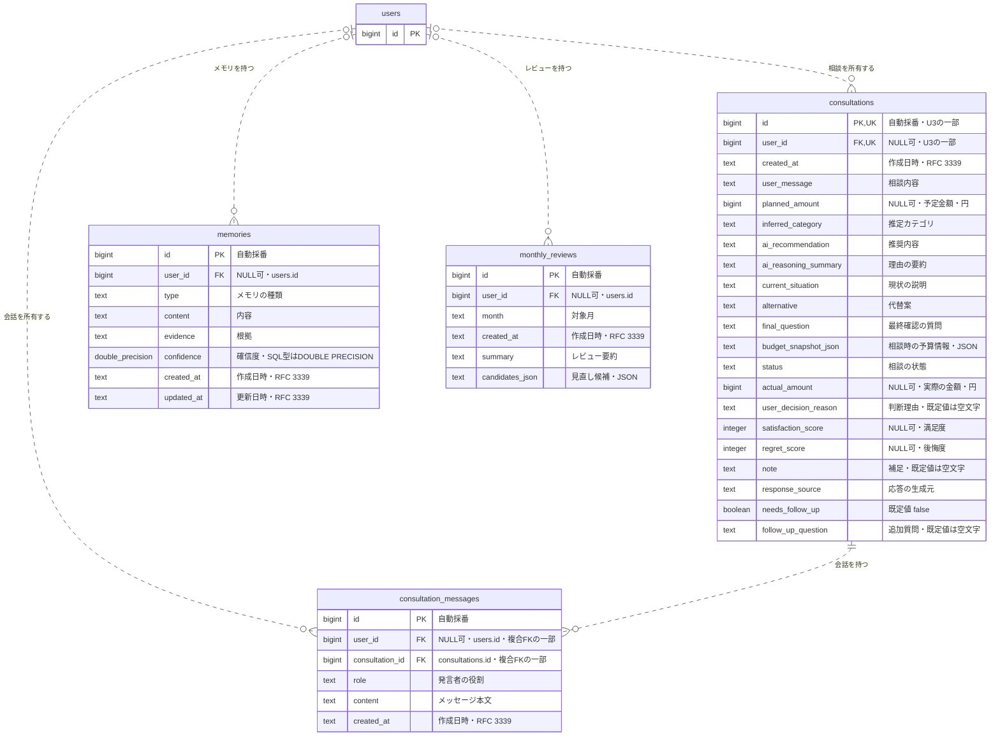

# ER図

PostgreSQLの`001_init.sql`から`008_monthly_costs.sql`までを適用した後の物理スキーマです。認証・運用設定・家計データ・相談データに分けて示します。実DBを読み取った図ではなく、リポジトリ内のDDLに基づきます。

正本: [PostgreSQL migration](../server/internal/infrastructure/persistence/postgres/)

`PK`は主キー、`FK`は外部キー、`UK`は一意制約です。複合一意制約の列には同じ制約番号を付記しています。`NULL可`の記載がない列はNOT NULLです。`bigserial`はシーケンスで採番されるbigintとして表記します。関連線は外部キーが存在する関係だけを表します。

## 認証・運用管理

ユーザーは管理者がDBへ直接登録します。ユーザーごとに複数のセッションを保持できます。ログイン試行制限とマイグレーション履歴には外部キーがありません。

```mermaid
erDiagram
    users ||..o{ auth_sessions : "セッションを持つ"
    users ||--o| user_consultation_limits : "個別上限を持つ"
    users ||--o{ monthly_consultation_usage : "月次相談数を持つ"
    users ||--o{ admin_notifications : "管理者通知を発生させる"
    users ||--o{ llm_usage : "外部モデルを利用する"

    users {
        bigint id PK "自動採番・正の値"
        text username UK "3〜128文字・小文字ASCII等"
        text password_hash "PBKDF2ハッシュ"
        boolean is_active "既定値 true"
        timestamptz created_at "既定値 CURRENT_TIMESTAMP"
    }
    auth_sessions {
        text token_hash PK "BearerトークンのSHA-256"
        bigint user_id FK "users.id"
        text password_hash "発行時の資格情報スナップショット"
        timestamptz expires_at "有効期限"
    }
    auth_attempts {
        text key PK "IPまたはユーザー名から作るハッシュ"
        integer attempts "期間内のログイン試行回数"
        timestamptz window_end "制限期間の終了日時"
    }
    service_settings {
        text key PK "設定名"
        bigint integer_value "0以上"
        timestamptz updated_at "既定値 CURRENT_TIMESTAMP"
    }
    user_consultation_limits {
        bigint user_id PK, FK "users.id"
        bigint monthly_limit "0以上"
        timestamptz updated_at "既定値 CURRENT_TIMESTAMP"
    }
    monthly_consultation_usage {
        bigint user_id PK, FK
        text month PK "日本時間のYYYY-MM"
        bigint consultation_count "0以上"
        timestamptz updated_at
    }
    admin_notifications {
        bigint user_id PK, FK
        text month PK
        text notification_type PK
        text status "sending delivered failed"
        integer attempts
    }
    llm_usage {
        bigint id PK
        bigint user_id FK
        text operation
        text model
        bigint input_tokens
        bigint cached_input_tokens
        bigint output_tokens
        bigint reasoning_tokens
        bigint total_tokens
        timestamptz occurred_at
    }
    llm_model_prices {
        text model PK
        date effective_from PK
        numeric input_usd_per_million
        numeric cached_input_usd_per_million
        numeric output_usd_per_million
    }
    monthly_operating_costs {
        text month PK
        numeric infrastructure_cost_usd
        integer support_case_count
        integer support_minutes
    }
    schema_migrations {
        bigint version PK "適用済みバージョン"
        timestamptz applied_at "適用日時"
    }
```

- `auth_sessions.user_id`は必須です。ユーザー削除時はセッションも削除されます（ON DELETE CASCADE）。
- `auth_sessions.password_hash`は外部キーではありません。認証時にユーザーの現在のハッシュと比較し、パスワード変更後の旧セッションを拒否します。
- `auth_attempts.key`は`users.id`ではありません。未登録ユーザーへの試行やIP単位の制限も記録するため、`users`との外部キーを持ちません。
- 月間相談上限は`user_consultation_limits`の利用者別設定を優先し、行がなければ`service_settings`の`default_monthly_consultation_limit`を使います。利用者削除時は個別上限も削除されます。
- `monthly_consultation_usage`は新規相談だけを数え、`admin_notifications`は上限通知を利用者・月ごとに一意化します。
- `llm_usage`は費用集計用のtoken数だけを保持し、相談内容やモデル出力を保持しません。`llm_model_prices`と`monthly_operating_costs`にはユーザー外部キーがありません。

## プロフィール・取引・分類ルール

ユーザーはプロフィールを最大1件、取引と分類ルールを複数件持ちます。業務テーブルの`user_id`は既存データを保全するためNULLを許容します。このため、物理スキーマ上は各業務レコードの所有者が0または1人となります。

| テーブル | 一意制約 | 意味 |
| --- | --- | --- |
| `profiles` | `UNIQUE(user_id)` | 所有者を持つプロフィールは1ユーザーにつき最大1件 |
| `transactions` | U1: `UNIQUE(user_id, fingerprint)` | 重複取引の判定はユーザー単位 |
| `merchant_rules` | U2: `UNIQUE(user_id, normalized_merchant)` | 同じ加盟店でもユーザーごとに分類を設定可能 |

`002_auth.sql`で`profiles.id`と`merchant_rules.normalized_merchant`の旧主キーを削除しているため、この2テーブルには現在、主キー制約がありません。`profiles.id = 1`のCHECK制約とNOT NULLは残ります。PostgreSQLの通常のUNIQUE制約はNULL同士を同一と扱わないため、所有者NULLのレコードには上表のユーザー単位の一意性が適用されません。

加盟店名やカテゴリにマスターテーブルへの外部キーはありません。`transactions.normalized_merchant`と`merchant_rules.normalized_merchant`の対応はアプリケーションによる分類処理で使う値の一致であり、DB上のリレーションではありません。

## 相談・会話・メモリ・月次レビュー

相談は複数の会話メッセージを持ちます。メモリと月次レビューはユーザーに属しますが、相談との外部キーはありません。

| 制約 | 定義・動作 |
| --- | --- |
| U3 | `consultations UNIQUE(id, user_id)`。会話から所有者込みで参照するための複合一意制約 |
| 会話の単列FK | `consultation_messages.consultation_id → consultations.id`。相談の存在を必須にする |
| 会話の複合FK | `(consultation_id, user_id) → consultations(id, user_id)`。所有者付きの会話が別ユーザーの相談に紐づくことを防ぐ |
| 相談削除 | 上記2つのFKはいずれもON DELETE CASCADE。関連メッセージも削除される |
| 月次レビュー | `(user_id, month)`の一意制約はなく、同じ月のレビューを複数回保存できる |

複合FKはPostgreSQL既定のMATCH SIMPLEです。会話の`user_id`がNULLの場合、複合FKの照合は行われませんが、単列FKによる相談の存在確認は残ります。APIは新しい会話に認証済みユーザーのIDを設定します。

## DB制約とアプリケーションの責務

- **所有者の認可**: 業務データの作成・参照・更新・削除に認証済みユーザーのIDを使います。FKだけで他ユーザーの参照を防ぐ設計ではなく、Repositoryの所有者条件が必要です。
- **旧データ**: `user_id IS NULL`の業務データはAPIから見えません。移行手順で所有者を明示的に割り当てます。
- **ユーザー削除**: セッション以外のユーザーFKは既定のNO ACTIONです。所有する業務データが残っていればユーザーの削除は拒否されます。通常の利用停止には`is_active = false`を使います。
- **DB外のデータ**: CSVインポートのプレビューはGoプロセスのメモリに保存し、ユーザーIDと30分の期限を持ちます。DBテーブルではないため図には含めません。
- **派生データ**: ダッシュボードは取引等から集計し、専用テーブルを持ちません。JSON列の内容も独立したエンティティとしては図示していません。

関連資料: [認証設計・ユーザー登録・既存データ移行](../server/docs/authentication.md) / [スキーマの運用手順](../server/docs/database-schema.md) / [サーバーアーキテクチャ](server/overview.md)

DDLを変更した際はこの図のカラム、NULL可否、一意制約、外部キーと多重度を併せて更新してください。
