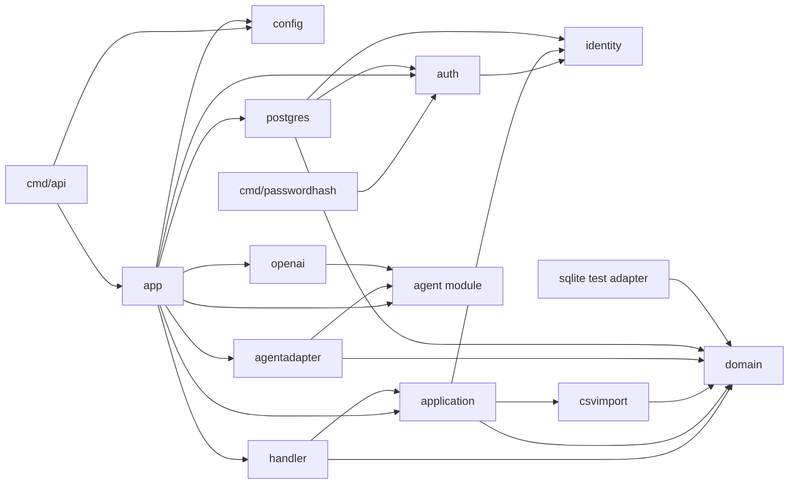
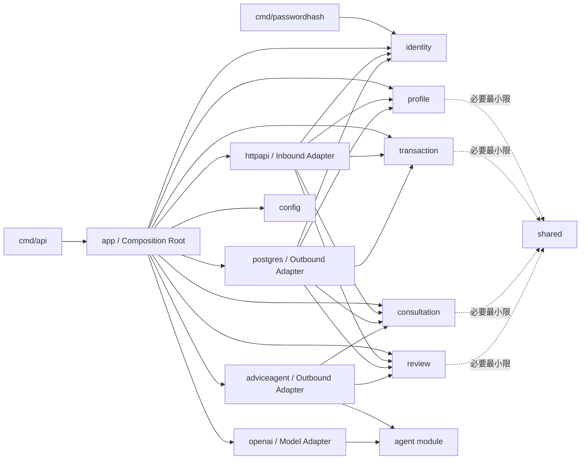
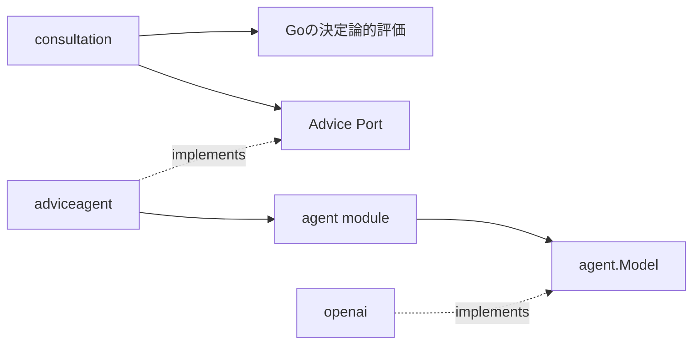
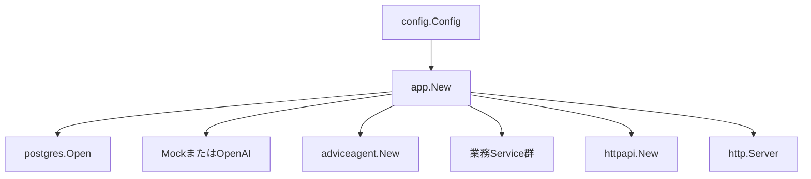
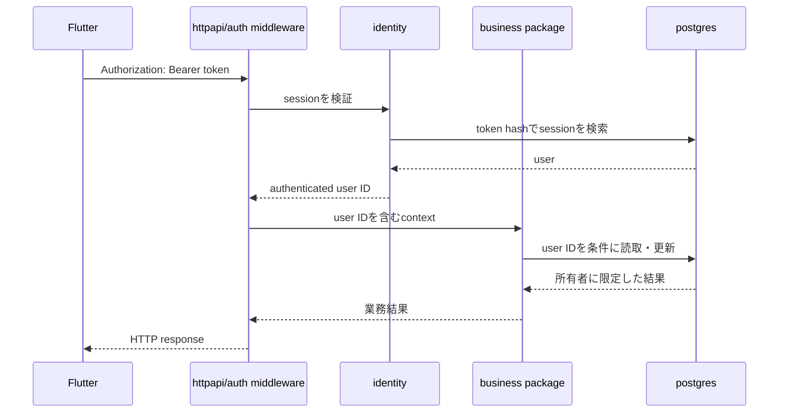
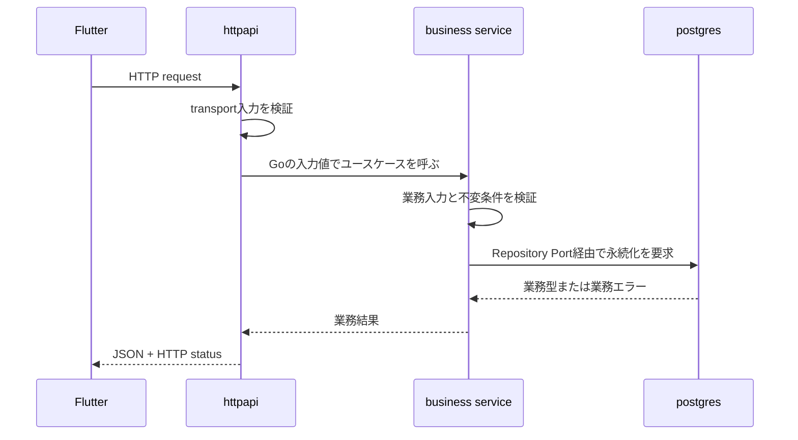
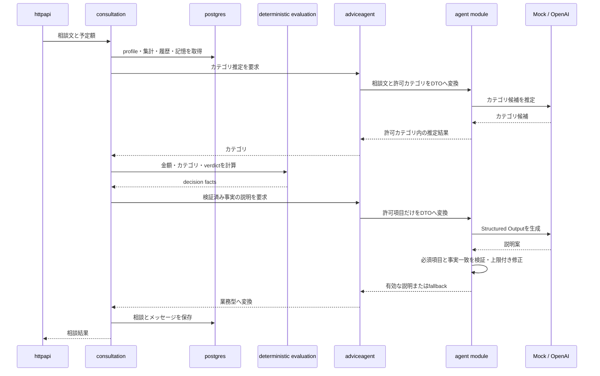

# Server Software詳細設計

この文書は、Go server内部のpackage、Port、Adapterの依存関係と、その設計理由を説明します。System ArchitectureとSoftware Architectureの選定理由は[ADR-0001](../adr/0001-server-modular-monolith-hexagonal.md)、変更時に守るルールは[サーバーのアーキテクチャ](architecture.md)を正本とします。

## この文書の読み方

図中の矢印`A → B`は、原則として「AがBをcompile時に参照する」依存方向を表します。HTTPリクエストや関数呼出しの時間的な順序ではありません。実行順を示す図には、その旨を明記します。

現行構成と目標構成を区別します。

- **現行構成**: 現在のコードと`tools/server_architecture.py`が検査している依存関係
- **目標構成**: ADR-0001で採用した、業務packageをApplication CoreとするHexagonal Architecture

目標構成は設計方針であり、まだ実装されていません。移行中も、現行のHTTP契約、金融判定、所有者条件、Agentへの送信項目を維持します。

## Arranで採用する標準構成

「Hexagonal Architecture」という名称だけでは、Portの置き場所、ApplicationとDomainの分担、Adapterの粒度に複数の解釈が生じます。そのため、Arranのserverでは次の構成を規範とします。別の構成もHexagonal Architectureと呼べるかどうかではなく、この依存方向に合っているかで設計を判断します。

```text
HTTP request
    ↓
HTTP Handler                  Inbound Adapter
    ↓
Business Service             Use Case / Application Core
    ├── Domain               決定論的な業務ルール
    ├── Repository Port      DBに要求する操作
    │       ↓
    │   PostgreSQL Adapter   SQLと業務型の変換
    │       ↓
    │   PostgreSQL
    │
    └── Agent Port           AIに要求する操作
            ↓
        Agent Adapter        Agent DTOとの変換
            ↓
        Agent Model Port
            ↓
        OpenAI / Mock Adapter
```

具体実装の生成と接続は、この流れの外側にある`app`だけが担当します。

### 構成要素と責務

GoではJavaやKotlinのようなclassを中心に設計せず、package、struct、interface、関数で責務を表します。この文書で「型」と書く場合は、主にstructまたはinterfaceを指します。

| 構成要素 | 配置先 | 実装形式 | 担う責務 | 担わない責務 |
| --- | --- | --- | --- | --- |
| HTTP Handler | `internal/httpapi` | Handler structとメソッド | route、HTTP入力、HTTP出力、status code | SQL、金融判定、LLM呼出し |
| Business Service | 各業務package | `Service` structと公開メソッド | ユースケースの進行、入力検証、Port呼出し | HTTP表現、SQL、外部SDK |
| Domain | 各業務package内 | 業務型、値、純粋関数 | 不変条件、計算、決定論的な判定 | I/O、環境変数、時刻の直接取得 |
| Repository Port | 利用する業務package | 小さなinterface | 業務処理が必要とする保存・取得操作 | SQL、DB接続管理 |
| Agent Port | 利用する業務package | 小さなinterface | カテゴリ推定、説明生成などの要求 | provider固有DTO、prompt送信処理 |
| PostgreSQL Adapter | `internal/postgres` | Repository structとメソッド | SQL実行、行と業務型の変換、transaction | ユースケースの判断 |
| Agent Adapter | `internal/adviceagent` | Adapter structとメソッド | 業務型とAgent DTOの変換、送信項目の制限 | 金融判定の変更 |
| Model Adapter | `internal/openai`など | Model実装 | OpenAI等の外部APIとの通信 | 業務判断、DB操作 |
| Composition Root | `internal/app` | `App`とconstructor | Configを読み、具体実装を生成してPortへ接続 | 業務ルール、HTTP入力処理 |

### Java・Kotlinとの対応

| Java・Kotlinでの典型的な表現 | ArranのGo構成 | Hexagonal Architecture上の役割 |
| --- | --- | --- |
| `@RestController` | HTTP Handler | Inbound Adapter |
| `@Service` | Business Service | Application Core / Inbound Port相当 |
| Domain Model、Domain Service | 業務型、純粋関数 | Domain |
| Repository interface | Repository Port | Outbound Port |
| `implements Repository` | PostgreSQL Adapter | Outbound Adapter |
| 外部API用interface | Agent Port | Outbound Port |
| 外部API client実装 | Agent／Model Adapter | Outbound Adapter |
| `@Configuration`、DI Container | `app.New` | Composition Root |

Repositoryパターンは、DBに対するOutbound PortとAdapterの実現方法です。ArranのHexagonal Architectureは同じ依存逆転をDBだけでなく、Agent、OpenAI、HTTP入力にも適用します。

### 業務packageの標準形

目標構成では、業務上の関心ごとごとに次の要素を同じpackageへ置きます。ファイル名は責務を見つけるための標準であり、巨大なファイルへの集約は意図しません。

```text
internal/<business>/
├── service.go       # Serviceと公開ユースケース
├── model.go         # 業務型、値オブジェクト
├── rules.go         # I/Oを伴わない決定論的な業務ルール
├── repository.go    # この業務が必要とするRepository Port
└── agent.go         # 必要な場合だけ置くAgent Port
```

対象となる業務packageは次の5つです。

| 業務package | Serviceが担当するユースケース | 主なPort |
| --- | --- | --- |
| `identity` | login、logout、session解決 | User／Session Store |
| `profile` | プロフィール取得・更新 | Profile Repository |
| `transaction` | CSV取込、取引一覧・修正、月次集計 | Transaction Repository |
| `consultation` | 相談開始・継続・結果登録 | Consultation Repository、Category／Advice Agent |
| `review` | 月次レビュー、記憶の管理・抽出 | Review／Memory Repository、Review／Memory Agent |

複数業務で使うという理由だけで、業務型やRepository Portを`shared`へ移しません。利用側の業務packageが、自分に必要な型とPortを所有します。複数package間の調整が必要なユースケースは、主たる業務packageのServiceが公開ユースケースまたは用途別Portを通して行います。

### 許可する呼出し経路

DBを使う処理は、必ず次の経路を通します。

```text
HTTP Handler
    → Business Service
        → Repository Port
            → PostgreSQL Adapter
                → PostgreSQL
```

Agentを使う処理は、必ず次の経路を通します。

```text
HTTP Handler
    → Business Service
        → Agent Port
            → Agent Adapter
                → Agent Model Port
                    → OpenAIまたはMock Adapter
```

次の依存や呼出しは禁止します。

- HTTP HandlerからRepository、SQL、Agent、OpenAIを直接呼ぶ
- Business ServiceからPostgreSQL、`pgx`、OpenAI SDK、環境変数を直接参照する
- PostgreSQL AdapterやAgent Adapterで、ユースケースの開始・分岐を決める
- Domainの関数からDB、HTTP、Agent、現在時刻を直接参照する
- 一つの業務packageから別の業務packageの具体Serviceを相互に参照する
- `app`以外で、環境に応じた具体Adapterを選択する

### 現行実装との対応

現行実装は移行前のため、標準構成の複数の責務を少数の型に集約しています。

| 標準構成上の責務 | 現行実装 | 移行方針 |
| --- | --- | --- |
| HTTP Handler | `handler.handler` | `httpapi`へ移し、業務別Handlerへ分割する |
| Business Service | `application.Application` | `profile.Service`など業務packageへ分割する |
| Domain | `domain`の型・関数 | 対応する業務packageへ段階的に移す |
| Repository Port | `application`の用途別Repository interface | 対応する業務packageが所有する |
| Agent Port | `application`のAgent interface | `consultation`、`review`が用途別に所有する |
| PostgreSQL Adapter | `infrastructure/persistence/postgres.Repository` | `postgres` AdapterとしてPortを実装する |
| Agent Adapter | `agentadapter.adapter` | `adviceagent`として型変換と外部接続に限定する |
| Model Adapter | `infrastructure/openai.client` | `openai`としてAgentのModel Portを実装する |
| Composition Root | `app.App`、`app.New` | 現在の責務を維持する |

現行の`agentadapter.Run`は、カテゴリ推定、`domain.EvaluateSpending`、説明生成の順序も制御しています。目標構成では、この進行制御を`consultation.Service`へ移します。`adviceagent`はカテゴリ推定・説明生成とDTO変換だけを担当し、最終`verdict`を決めません。

## 現行構成の依存関係



### 現行構成で守っていること

1. `domain`は他の`internal` package、HTTP、DB、LLMへ依存しません。
2. `application`はPostgreSQL、OpenAI、独立Agent、`agentadapter`の具体実装へ依存しません。
3. `handler`はSQLや外部モデルを呼ばず、HTTPとApplicationの変換に限定します。
4. `app`だけがproduction用の具体実装を選び、接続します。
5. `agentadapter`だけが業務モデルとAgent DTOを相互変換します。
6. `server/agent`は親serverの`internal`をimportしません。

この構成により、決定論的な金融判断を外部モデルから分離できています。一方、複数の業務機能が`application`、`handler`、PostgreSQL Repositoryへ集まっており、機能単位の所有者はpackage構成だけでは判別しにくい状態です。

## 目標構成の依存関係



`identity`、`profile`、`transaction`、`consultation`、`review`がApplication Coreです。これらのpackageは、HTTP、SQL、`pgx`、OpenAI DTO、環境変数を参照しません。

`postgres`や`adviceagent`から業務packageへ矢印が向くのは、Adapterが利用側の型とPortを実装するためです。業務packageからAdapterへ逆向きのimportは作りません。

## 依存方向をこの形にする理由

### 1. 金融判断を外部モデルから守る

Arranでは、残額、予算超過、支出後残額、最終`verdict`をGoの決定論的なロジックで計算します。LLMは、その事実を説明する役割です。

`consultation`からOpenAIへ直接依存すると、プロンプトやproviderの変更が金融判断へ入り込みやすくなります。そこで、`consultation`は説明生成に必要なPortだけを所有し、`adviceagent`がAgentとの接続を実装します。



この境界により、OpenAIが失敗しても、金融判定を変更せずモックへfallbackできます。

### 2. HTTP契約と業務処理を分離する

`httpapi`は、パス、HTTP method、JSON、multipart、status code、CORSを扱います。業務packageは、HTTPではなくGoの入力値と業務エラーを扱います。

これにより、次を分離できます。

- JSON形式の誤りと業務入力の不備
- HTTP status codeと業務エラー
- Bearer tokenの検証と、認証済み利用者が行うユースケース
- HTTP timeoutと、Repository・Agentへ渡す`context.Context`

HTTP HandlerからSQLや金融計算を直接実行しないため、API表現の変更が業務ルールへ波及しにくくなります。

### 3. Portを利用側に置く

Portは、外部実装が提供したい機能ではなく、業務処理が必要とする機能を表します。そのため、RepositoryやAgentのinterfaceは利用する業務packageが所有します。

```go
package consultation

type Repository interface {
	Create(context.Context, Consultation) (Consultation, error)
	Get(context.Context, int64) (Consultation, error)
}

type AdviceGenerator interface {
	Generate(context.Context, AdviceInput) (AdviceDraft, error)
}
```

PostgreSQLの全操作を持つ巨大な共通interfaceや、外部SDKをなぞるinterfaceは作りません。テストで差し替える必要がなく、単純なpackage内関数で表現できる処理もinterface化しません。

### 4. Composition Rootを一つにする

具体実装の生成と接続は`internal/app`へ集約します。



Application Coreで環境変数を読んだり、`USE_MOCK_LLM`に応じて実装を選んだりしません。実行環境に応じた選択を`app`へ閉じ込めることで、業務処理を同じ入力でテストできます。

### 5. 認証と所有者認可を分ける

認証は、Bearer tokenから利用者を特定する処理です。所有者認可は、認証済み利用者が自分のデータだけを操作できるよう、Repository操作を`user_id`で制限する処理です。

実行順は次のとおりです。



HTTP middlewareを通過したことだけで所有者認可済みとは扱いません。別ユーザーのIDを指定しても操作できないことを、Repositoryの条件と統合テストで保証します。

### 6. Agent境界で送信データを絞る

業務モデルをそのままAgent DTOへ変換すると、モデルに項目を追加したとき、意図せず外部送信対象が増える可能性があります。`adviceagent`では、送信を許可する項目を明示的に転記します。

取引情報は次の3項目に限定します。

- 取引日
- 金額
- カテゴリ

CSV原文、加盟店名、口座名、明細本文は送信しません。この制約はpackage境界だけでは保証できないため、静的チェッカーと差分レビューの両方で確認します。

### 7. 共有DBでもデータ所有者を決める

Modular MonolithではPostgreSQLを共有しますが、すべての業務packageが任意のテーブルを直接更新する構成にはしません。

| 業務package | 主に所有するデータ |
| --- | --- |
| `identity` | users、auth_sessions、auth_attempts |
| `profile` | profiles |
| `transaction` | transactions、merchant_rules、月次集計Read Model |
| `consultation` | consultations、consultation_messages |
| `review` | monthly_reviews、memories |

横断参照は、次の優先順位で設計します。

1. 所有packageの公開ユースケースを呼ぶ
2. 利用側が必要な読取Portと用途別の型を定義する
3. 複数テーブルの集計が必要なら、用途を明示したRead Modelを`postgres`で実装する

具体Service同士を相互にimportしません。循環importを避けるためだけに、業務モデルを`shared`へ移しません。

## リクエスト処理の詳細

### 通常の業務API



HandlerはDBエラー文字列を直接判定しません。Not Found、入力不備、競合など、利用者へ返す必要がある業務エラーへApplication CoreまたはAdapter境界で変換し、HTTP Adapterがstatus codeへ対応付けます。

### 支出相談



カテゴリ推定にはAgentを利用しますが、支出可否を表す最終`verdict`は、推定カテゴリと金額を入力としてGoで確定します。その後、検証済みの事実だけを説明生成へ渡し、LLM出力を採用する前に再検証します。LLMの失敗や不正出力を、金融判断の変更やAPI全体の停止へ広げないためです。

## エラー、context、トランザクション

- `context.Context`はHTTP境界からRepository・Agentまで渡し、キャンセルとtimeoutを伝播させます。
- HTTP固有のstatus codeやレスポンス文言をApplication Coreへ持ち込みません。
- SQLエラーはPostgreSQL Adapterからそのまま利用者へ返さず、必要な業務エラーへ変換します。
- 複数更新を一体として成功させる必要がある処理は、PostgreSQL Adapterでトランザクション境界を明示します。
- 外部モデル呼出しとDBトランザクションを同じ長時間トランザクションで囲みません。
- fallbackはエラーを隠す一般機構ではなく、業務ルールで許可したAgent失敗時だけに使います。

## 自動検査とレビュー

現行の`tools/server_architecture.py`は、現在のpackage構成に対して次を検査します。

- 許可していない`internal` package間import
- Application Coreからinfrastructureへの逆向き依存
- 独立Agentから親serverへの依存
- PostgreSQL、OpenAI実装の参照元
- Agentへ渡す取引DTOの許可項目

業務packageへの移行時は、package追加と同じ変更で依存許可表と検査テストを更新します。チェッカーを一時的に無効化したり、ディレクトリ単位の例外を追加したりしません。

次は静的なimport検査だけでは判断できないため、差分レビューと振る舞いテストで確認します。

- 金融判断がAgent側へ移っていないか
- DTOの既存項目へ別の意味の値を詰めていないか
- Repository操作が認証済み`user_id`で制限されているか
- 業務エラーとHTTP応答の対応が適切か
- Portが利用側の必要範囲を超えて肥大化していないか

## 移行の単位

移行は業務機能単位で行い、ディレクトリだけを先に作りません。

1. 現行の`application.go`と`handler.go`を、挙動を変えず機能別ファイルへ分割する
2. 対象機能の業務型、ユースケース、必要なPortを同じpackageへ集める
3. HTTP、PostgreSQL、Agentの実装を対応するAdapterへ移す
4. `app`の組立て、依存チェッカー、テストを同じ変更で更新する
5. OpenAPI互換性、金融判定、所有者条件、Agent送信項目を検証する
6. 移行済みの範囲だけ旧packageから削除する

一つの変更で全機能を移行しません。移行対象外の現行packageを、目標構成に合わせる目的だけで変更しません。

## 関連資料

- [ADR-0001](../adr/0001-server-modular-monolith-hexagonal.md)
- [Serverの全体像](overview.md)
- [サーバーのアーキテクチャ](architecture.md)
- [サーバーの実装作法](conventions.md)
- [OpenAPI](../../server/docs/openapi.yaml)
- [DBスキーマ](../../server/docs/database-schema.md)
